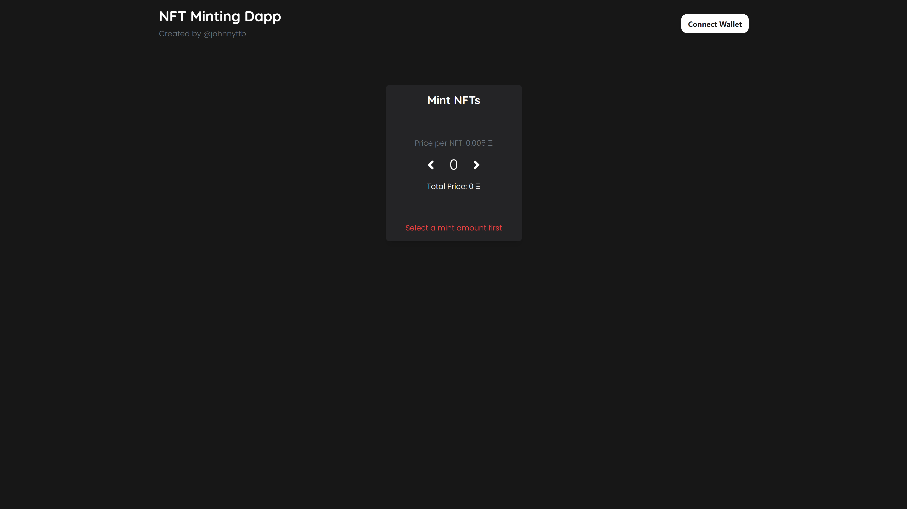
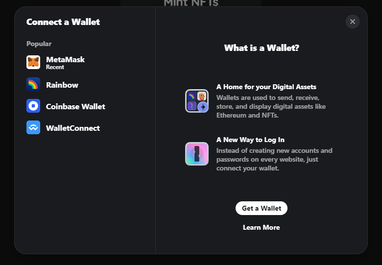
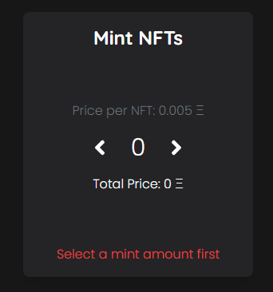
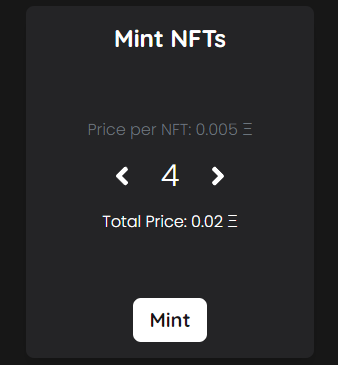
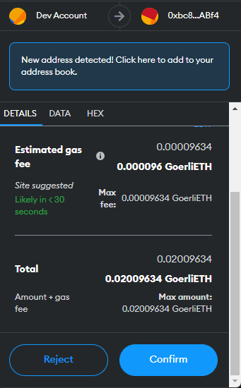
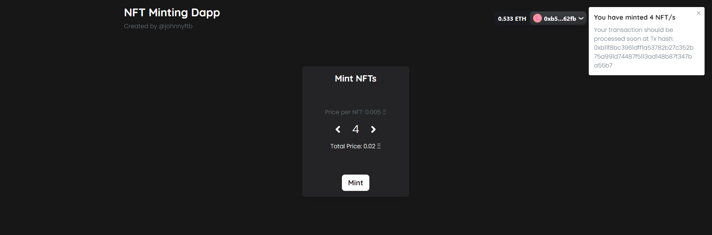
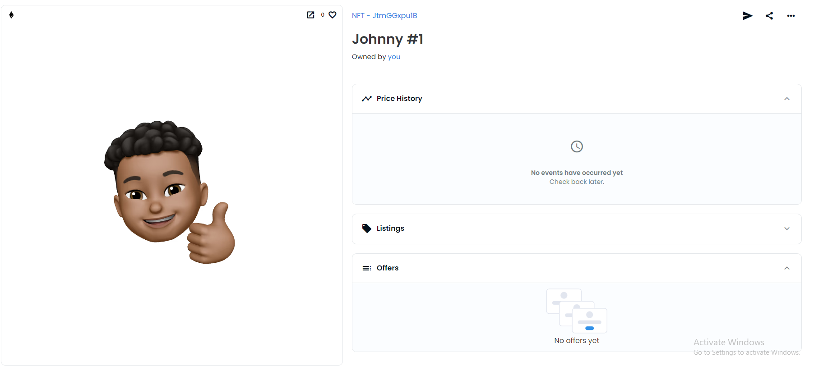

# NFT Minting Dapp

This is an NFT Minting Dapp that allows users to interact with a NFT minting smart contract and mint NFTs.

## Connecting a Wallet
The Dapp utilizes wagmi and RainbowKit to give users a smooth and aesthetic connecting experience. By clicking the 'Connect Wallet' button on the top right, they are able to choose from multiple wallet providers to connect their Ethereum wallet.

## Selecting a Mint Amount

Users can select how many NFTs they would like to mint. After picking a number, they are able to send a transaction to the smart contract by clicking the 'mint' button.

## Sending the Transaction
After clicking the 'mint' button, they are transported to their wallet provider's prompt page - in this case, it is metamask. Users can review the transaction once more before sending it.

## Transaction Sent!
Once users confirm the transaction and it is sent successfully, a notification (courtesy of React Toastify) will appear that informs them the transaction was successful, with the transaction hash.

## NFT Minted
Users can now view their NFT on a platform like Opensea.

## Technologies Used
- Next.js / React.js
- TailwindCSS
- wagmi & RainbowKit
- React Toastify
- TypeScript